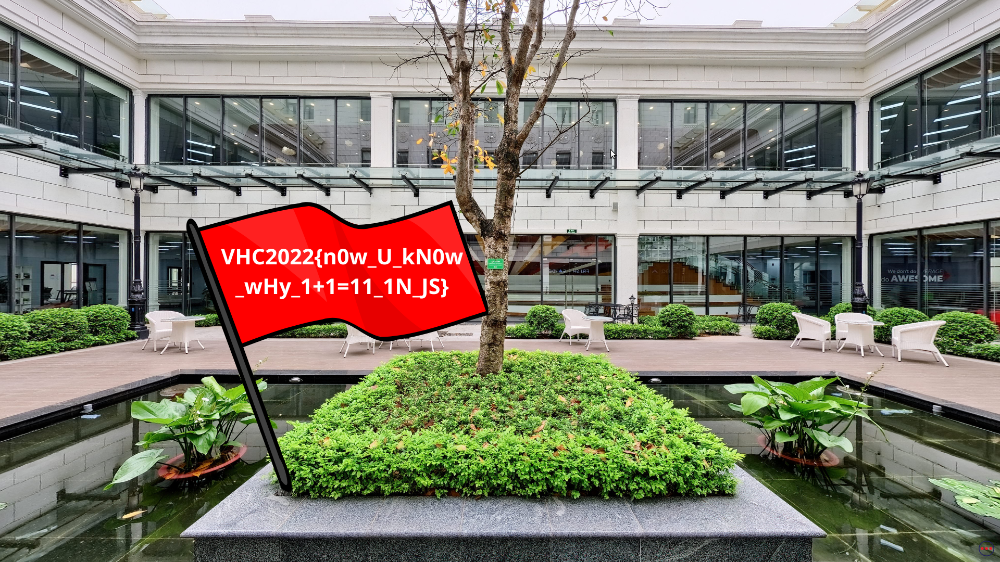

# Garden Ramsay

Having a coffee in Fresh Garden, then look outside for a second. Can you spot the hidden?

Challenge URL: http://ctflag.vhc.asia:19024/

## Method:

F12 Dev Tools + JavaScript + Brute-force

## Solution

This is a typical web challenge that involves using F12 Developer Tool to find the password for the 6-digit lock.

We can find a JavaScript function for checking the password, and since we only have $10^6$ passwords to check, we can just run a simple loop to check them all.

```js
for (let i = 0; i < 1000000; i++) {
    let s = String(i);
    if (checkPass(s)) {
        console.log(s);
    }
}
```

Then we have two correct passwords.

```
150120
150131
```

`150131` doesn't work (maybe due to server-side validation), so the answer is `150120`.

And below is the image of the flag! `VHC2022{n0w_U_kN0w_wHy_1+1=11_1N_JS}`

